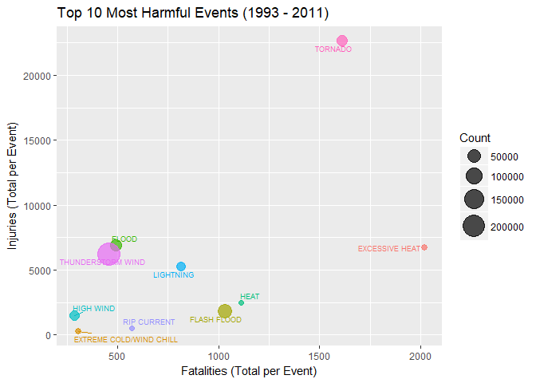

# Severe Weather Events and their Impact on Public Health and Economy

## 1. Synopsis  

The aim of this report is to identify the most harmful weather types in the US both regarding to population health (fatalities and injuries) and economy (property and crop damages). The analysis uses data from the NOAA Storm Database for the years 1993 through 2011. A big part of this analysis was cleaning the data and grouping it finally to 48 distinct event types. As the quality of the data often seemed not very accuarate all findings here should be handled very carefully. The monetary amounts for damages are adjusted by CPI with base year 2017.  

As to consequences to population health the events “EXCESSIVE HEAT” and “TORNADO” are the most harmful ones, followed by events “HEAT” and “FLASH FLOOD”, while event “TORNADO” is also responsible for an unusual high number of injuries.  

Most harmful events with respect to economy is clearly “HURRICANE/TYPHOON”, with nearly twice the damages than “FLOOD” and “STORM SURGE/TIDE” events. Property damages mostly outstand crop damages except for “DROUGHT”.

## 2. Data Processing  

The necessary R libraries:

```r
require(data.table)
require(dplyr)
require(quantmod)
require(ggplot2)
require(lubridate)
require(knitr)
require(ggrepel)
```

### 2.1. Load the data  
Check if either unzipped or zipped original NOAA Storm Database file exists (if necessary download and unzip it):

```r
data_file <- 'stormData.csv'

if (! file.exists('./data')) {
    dir.create('./data')
}
if(! file.exists(file.path('./data', data_file))){
    zip_archive <- './data/stormData.csv.bz2'
    if (! file.exists(file.path('./data', zip_archive))) {
        print('No zip archive!')
        url_arch<-'https://d396qusza40orc.cloudfront.net/repdata%2Fdata%2FStormData.csv.bz2'
        download.file(url = url_arch, destfile = zip_archive)
    }
    unzip("data/stormData.csv.bz2")
    require(R.utils)
    bunzip2("data/stormData.csv.bz2", "data/stormData.csv",
            remove = FALSE, skip = TRUE)
}
```

Load the data into a data.table (faster than data.frame) object.

```r
data <- fread('data/stormData.csv')
```

The data consists of 902297 observations and 37 variables:

```r
dim(data)
```

```
## [1] 902297     37
```

### 2.2. Preprocess the data

Disregarding the unique variable REFNUM, the data set contains 3143 duplicates. The duplicated observations will be removed.

```r
dupl_index <- select(data, -REFNUM) %>% duplicated()
data <- data[!dupl_index,]
sum(dupl_index)
```

```
## [1] 3143
```

Converting the character variable BGN_DATE to a class 'Date' variable.

```r
data[, BGN_DATE:= as.Date(mdy_hms(BGN_DATE))]
data[, YEAR:=year(BGN_DATE)]
summary(data$BGN_DATE)
```

```
##         Min.      1st Qu.       Median         Mean      3rd Qu. 
## "1950-01-03" "1995-04-20" "2002-03-09" "1998-12-30" "2007-07-19" 
##         Max. 
## "2011-11-30"
```

Exploring the data set we concluded that following variables are sufficient for answering the questions we are interested in:

```r
names(data)[c(2, 8, 23:28)]
```

```
## [1] "BGN_DATE"   "EVTYPE"     "FATALITIES" "INJURIES"   "PROPDMG"   
## [6] "PROPDMGEXP" "CROPDMG"    "CROPDMGEXP"
```

For convenience we load only them (additionally some information on state/county and the remarks variable)

```r
data <- data[, .(REFNUM, YEAR, BGN_DATE, EVTYPE, STATE, COUNTYNAME,
                 FATALITIES, INJURIES,
                 PROPDMG, PROPDMGEXP, CROPDMG, CROPDMGEXP,
                 REMARKS)]
gc()
```

As our data spans more than sixty years we should think about making adjustments to the monetary values because of inflation. This can be done by obtaining CPI data from [FRED](https://fred.stlouisfed.org/) using R's 'quantmod' package.  
**Note that the CPI Index we adjusted to basis year 2017.**

```r
getSymbols("CPIAUCSL", src='FRED')
```

```
## 'getSymbols' currently uses auto.assign=TRUE by default, but will
## use auto.assign=FALSE in 0.5-0. You will still be able to use
## 'loadSymbols' to automatically load data. getOption("getSymbols.env")
## and getOption("getSymbols.auto.assign") will still be checked for
## alternate defaults.
## 
## This message is shown once per session and may be disabled by setting 
## options("getSymbols.warning4.0"=FALSE). See ?getSymbols for details.
```

```
## [1] "CPIAUCSL"
```

```r
cpi_monthly <- as.data.frame(CPIAUCSL) ; rm(CPIAUCSL)
cpi_monthly <- cbind(cpi_date = rownames(cpi_monthly), cpi_monthly)
cpi_monthly$cpi_date <- as.character(cpi_monthly$cpi_date)
cpi_monthly$cpi_year <- year(as.Date(cpi_monthly$cpi_date, format = "%Y-%m-%d"))

cpi_yearly <- cpi_monthly %>%
    group_by(cpi_year) %>% summarise(cpi = mean(CPIAUCSL)) %>% as.data.frame()
rm(cpi_monthly)
cpi_yearly$adj_factor <- cpi_yearly$cpi/cpi_yearly$cpi[cpi_yearly$cpi_year == 2017]
cpi_yearly <- cpi_yearly %>% 
    filter(cpi_year >= data[, min(year(BGN_DATE))] &
               cpi_year <= data[, max(year(BGN_DATE))])
cpi_yearly$cpi <- NULL
```
Now merge our adjusted CPI Index values for the years into our data.

```r
data <- merge(data, cpi_yearly, by.x = 'YEAR', by.y = 'cpi_year')
rm(cpi_yearly)
tail(data[, c(1:9)], 20)
```

```
##     YEAR REFNUM   BGN_DATE         EVTYPE STATE
##  1: 2011 902278 2011-11-07      DENSE FOG    VA
##  2: 2011 902279 2011-11-11     HEAVY SNOW    ID
##  3: 2011 902280 2011-11-12   WINTER STORM    AK
##  4: 2011 902281 2011-11-16       BLIZZARD    AK
##  5: 2011 902282 2011-11-03   WINTER STORM    AK
##  6: 2011 902283 2011-11-05       BLIZZARD    AK
##  7: 2011 902284 2011-11-12      HIGH WIND    CO
##  8: 2011 902285 2011-11-19     HEAVY SNOW    MI
##  9: 2011 902286 2011-11-16      HIGH WIND    WA
## 10: 2011 902287 2011-11-01        DROUGHT    OK
## 11: 2011 902288 2011-11-05 WINTER WEATHER    CO
## 12: 2011 902289 2011-11-28   FROST/FREEZE    TX
## 13: 2011 902290 2011-11-12      HIGH WIND    CO
## 14: 2011 902291 2011-11-28 WINTER WEATHER    MS
## 15: 2011 902292 2011-11-28 WINTER WEATHER    TN
## 16: 2011 902293 2011-11-30      HIGH WIND    WY
## 17: 2011 902294 2011-11-10      HIGH WIND    MT
## 18: 2011 902295 2011-11-08      HIGH WIND    AK
## 19: 2011 902296 2011-11-09       BLIZZARD    AK
## 20: 2011 902297 2011-11-28     HEAVY SNOW    AL
##                               COUNTYNAME FATALITIES INJURIES PROPDMG
##  1:                               VAZ053          0        0       0
##  2:                               IDZ004          0        0       0
##  3:                               AKZ212          0        0       0
##  4:                               AKZ019          0        0       0
##  5:                               AKZ216          0        0       0
##  6:                               AKZ214          0        0       0
##  7:                               COZ077          0        0       0
##  8:                               MIZ009          0        0       0
##  9:                               WAZ021          0        0       0
## 10:           OKZ004>038 - 040>048 - 050          0        0       0
## 11:                         COZ012 - 017          0        0       0
## 12:                         TXZ248 - 250          0        0       0
## 13:             COZ062 - 073 - 075 - 087          0        0       0
## 14:                         MSZ001 - 003          0        0       0
## 15: TNZ001>004 - 019>021 - 048>055 - 088          0        0       0
## 16:                         WYZ007 - 017          0        0       0
## 17:                         MTZ009 - 010          0        0       0
## 18:                               AKZ213          0        0       0
## 19:                               AKZ202          0        0       0
## 20:                               ALZ006          0        0       0
```
```

### 2.3 Property and Crop Damage Data Cleaning  
Values for damages are stored in numerical variables 'PROPDMG' (e.g. damages on buildings, power lines and vehicles) and 'CROPDMG' (e.g. crop damage, grain bins and cows killed).  
These two variables are accompanied by 'PROPDMGEXP' and 'CROPDMGEXP' with an alphabetical character signifying the magnitude of the values in variables 'PROPDMG' and 'CROPDMG' respectively, including “K” for thousands, “M” for millions, and “B” for billions.  
Having a look at PROPDMGEXP we can see that we have some undefined values like "-", "?", "+". For values like "0", "1", "2", etc. we also were not able to determine their explicit meaning. Furthermore there are 465168 observations with missing values "".

```r
table(data$PROPDMGEXP, useNA = 'ifany')
```

```
## 
##             -      ?      +      0      1      2      3      4      5 
## 465168      1      8      5    216     25     13      4      4     28 
##      6      7      8      B      h      H      K      m      M 
##      4      5      1     40      1      6 422350      7  11268
```

Converting lower to uppercases and only looking at observations where PROPDMG greater zero:

```r
data[, PROPDMGEXP := toupper(PROPDMGEXP)]
table(data[PROPDMG > 0, PROPDMGEXP], useNA = 'ifany')
```

```
## 
##             -      +      0      2      3      4      5      6      7 
##     76      1      5    209      1      1      4     18      3      2 
##      B      H      K      M 
##     40      7 226818  11264
```

Imputing NA's for observations that are not in the set of 'H', 'K', 'M', 'B':

```r
misc_exponents <- unique(data[ ! PROPDMGEXP %in% c('', 'H', 'K', 'M', 'B'), PROPDMGEXP])
data[, PROPDMGEXP:=
         ifelse( PROPDMGEXP %in% misc_exponents,
                 NA, PROPDMGEXP)]
```

Furthermore imputing 'NA's to empty PROPDMGEXP variables where there PROPDMG not equals zero:

```r
data[, PROPDMGEXP:=
         ifelse( PROPDMGEXP == '' & PROPDMG > 0,
                NA, PROPDMGEXP)]
```

Finally converting the variable to a numerical one with propper values set:

```r
data[, PROPDMGEXP:= ifelse(PROPDMGEXP == '', 0, PROPDMGEXP)]
data[, PROPDMGEXP:= 
         ifelse(PROPDMGEXP == 'H',
                10^2, ifelse(PROPDMGEXP == 'K', 10^3, 
                             ifelse(PROPDMGEXP == 'M', 10^6,
                                    ifelse(PROPDMGEXP == 'B', 10^9,
                                           PROPDMGEXP))))]

data[, PROPDMGEXP:= as.integer(PROPDMGEXP)]
```

After the conversions we end with following values (actually only 390 NA's):

```r
table(data$PROPDMGEXP, useNA = 'ifany')
```

```
## 
##          0        100       1000    1000000 1000000000       <NA> 
##     465092          7     422350      11275         40        390
```

Doing simularly for the variable CROPDMGEXP:

```r
data[, CROPDMGEXP := toupper(CROPDMGEXP)]
misc_exponents <- unique(data[ ! CROPDMGEXP %in% c('', 'H', 'K', 'M', 'B'), CROPDMGEXP])
data[, CROPDMGEXP:=
         ifelse( CROPDMGEXP %in% misc_exponents,
                 NA, CROPDMGEXP)]
data[, CROPDMGEXP:=
         ifelse( CROPDMGEXP == '' & CROPDMG > 0,
                 NA, CROPDMGEXP)]
data[, CROPDMGEXP:= ifelse(CROPDMGEXP == '', 0, CROPDMGEXP)]
data[, CROPDMGEXP:= 
         ifelse(CROPDMGEXP == 'K',
                10^3, ifelse(CROPDMGEXP == 'M', 10^6, 
                             ifelse(CROPDMGEXP == 'B', 10^9,CROPDMGEXP)))]
data[, CROPDMGEXP:= as.integer(CROPDMGEXP)]
table(data$CROPDMGEXP, useNA = 'ifany')
```

```
## 
##          0       1000    1000000 1000000000       <NA> 
##     617335     279794       1987          8         30
```

Now we have numerical exponent values to multiply the PROPDMG and CROPDMG variables with:

```r
data[, PROPDMG:= PROPDMG * PROPDMGEXP]
data[, CROPDMG:= CROPDMG * CROPDMGEXP]
```


```r
head(data[PROPDMG > 0, ])
```

```
##    YEAR REFNUM   BGN_DATE  EVTYPE STATE COUNTYNAME FATALITIES INJURIES
## 1: 1950      1 1950-04-18 TORNADO    AL     MOBILE          0       15
## 2: 1950      2 1950-04-18 TORNADO    AL    BALDWIN          0        0
## 3: 1950   6348 1950-01-13 TORNADO    AR       POLK          1        1
## 4: 1950   6349 1950-02-12 TORNADO    AR      GRANT          0        0
## 5: 1950   6350 1950-02-12 TORNADO    AR      UNION          0        0
## 6: 1950   6351 1950-03-26 TORNADO    AR      CLARK          0        3
##    PROPDMG PROPDMGEXP CROPDMG CROPDMGEXP REMARKS adj_factor
## 1:   25000       1000       0          0          0.0981585
## 2:    2500       1000       0          0          0.0981585
## 3:    2500       1000       0          0          0.0981585
## 4:    2500       1000       0          0          0.0981585
## 5:   25000       1000       0          0          0.0981585
## 6:   25000       1000       0          0          0.0981585
```

Finally converting the values for PROPDMG and CROPDMG variables to values in millions:

```r
data[, CROPDMG:= CROPDMG / 1000000]
data[, PROPDMG:= PROPDMG / 1000000]
```

### 2.4 Outliers or Doubtful Values  

It seems there are no real outliers for variable FATALITIES. The most fatalities with 583 are reported for the "1995 Chicago Heat wave". The second event in this list is "2011 Joplin Tornado". But actually we are missing "Hurricane Katrina" in this list.

```r
data[YEAR >= 1993 & FATALITIES > 90, c(3:5,7)][order(-FATALITIES)]
```

```
##      BGN_DATE         EVTYPE STATE FATALITIES
## 1: 1995-07-12           HEAT    IL        583
## 2: 2011-05-22        TORNADO    MO        158
## 3: 1999-07-28 EXCESSIVE HEAT    IL         99
```

There are also no outliers for variables INJURIES and CROPDMG. More interesting is PROPDMG. The first entry here relates to a flood in 2006 with damages of $115 billion (the next three events are now all belonging to "Hurricane Katrina")

```r
data[YEAR >= 1993 & PROPDMG > 10000, c(3:5,9)][order(-PROPDMG)]
```

```
##      BGN_DATE            EVTYPE STATE PROPDMG
## 1: 2006-01-01             FLOOD    CA  115000
## 2: 2005-08-29       STORM SURGE    LA   31300
## 3: 2005-08-28 HURRICANE/TYPHOON    LA   16930
## 4: 2005-08-29       STORM SURGE    MS   11260
```

This FLOOD event with stated wrongly $115 billion damages belongs to a series of events causing heavy **flooding of Napa and Russian River in Northern California (Dec 2005 - Jan 2006)**. According to this document [Storms and Flooding in California](https://pubs.usgs.gov/of/2006/1182/pdf/ofr2006-1182.pdf):  

> "The storms resulted in an estimated $300 million in damages and Federal disaster declarations in 10 counties..."  

Looking at these entries it seems that the amount of $11,500 million is an error due to wrong PROPDMGEXP. Furthermore it seems that we have duplicated entries for the estimated property damages. Both for Napa and Sonoma there are two events for different dates.  

```r
data[EVTYPE == 'FLOOD' & YEAR %in% c(2005,2006) & STATE == 'CA' &
         month(BGN_DATE) %in% c(12,1) &
         COUNTYNAME %in% c('SONOMA', 'NAPA'), c(3:6, 9:12)] %>% head()
```

```
##      BGN_DATE EVTYPE STATE COUNTYNAME PROPDMG PROPDMGEXP CROPDMG
## 1: 2005-12-31  FLOOD    CA     SONOMA     104    1000000     3.0
## 2: 2005-12-31  FLOOD    CA       NAPA     115    1000000    32.5
## 3: 2006-01-01  FLOOD    CA       NAPA  115000 1000000000    32.5
## 4: 2006-01-01  FLOOD    CA     SONOMA     104    1000000     3.0
##    CROPDMGEXP
## 1:    1000000
## 2:    1000000
## 3:    1000000
## 4:    1000000
```

We adjust the $115 billion entry to $115 million and remove values for the first of the two double entries:

```r
data[REFNUM == 605943, PROPDMG:=115]
# And we set the 2005-12-31 events to zero damages to avoid double count:
data[REFNUM %in% c(567206,567221), PROPDMG:=0]
data[REFNUM %in% c(567206,567221), CROPDMG:=0]
```

### 2.5 Event Variable EVTYPE  

We now have data for years 1950 until 2011, but as data collection procedures have changed, the unique event types the data was collected for has also changed over years. More information can be found on .

From 1950 through 1954 only TORNADO events were reported:

```r
table(data[year(BGN_DATE) <= 1954, EVTYPE])
```

```
## 
## TORNADO 
##    1858
```

And from 1955 through 1992 only the following events were reported for ( even if [NOAA Storm Events Database](https://www.ncdc.noaa.gov/stormevents/details.jsp) states the period 1955-1995):

```r
table(data[year(BGN_DATE) >= 1955 & year(BGN_DATE) <= 1992, EVTYPE])
```

```
## 
##      HAIL   TORNADO TSTM WIND 
##     61527     32644     90637
```

It will make no sense to compare total values for different events over all years if some of the events are only collected for a shorter period. Therefore we reduce our data set:

```r
data <- data[year(BGN_DATE) >= 1993]
```

We now should also be aware that according to the same source [NOAA Storm Events Database](https://www.ncdc.noaa.gov/stormevents/details.jsp) there should be only 48 different event types according to "Directive 10-1605" which we loaded here:

```r
events <- c("ASTRONOMICAL LOW TIDE",
            "AVALANCHE",
            "BLIZZARD",
            "COASTAL FLOOD",
            "COLD/WIND CHILL",
            "DEBRIS FLOW",
            "DENSE FOG",
            "DENSE SMOKE",
            "DROUGHT",
            "DUST DEVIL",
            "DUST STORM",
            "EXCESSIVE HEAT",
            "EXTREME COLD/WIND CHILL",
            "FLASH FLOOD",
            "FLOOD",
            "FROST/FREEZE",
            "FUNNEL CLOUD",
            "FREEZING FOG",
            "HAIL",
            "HEAT",
            "HEAVY RAIN",
            "HEAVY SNOW",
            "HIGH SURF",
            "HIGH WIND",
            "HURRICANE/TYPHOON",
            "ICE STORM",
            "LAKE-EFFECT SNOW",
            "LAKESHORE FLOOD",
            "LIGHTNING",
            "MARINE HAIL",
            "MARINE HIGH WIND",
            "MARINE STRONG WIND",
            "MARINE THUNDERSTORM WIND",
            "RIP CURRENT",
            "SEICHE",
            "SLEET",
            "STORM SURGE/TIDE",
            "STRONG WIND",
            "THUNDERSTORM WIND",
            "TORNADO",
            "TROPICAL DEPRESSION",
            "TROPICAL STORM",
            "TSUNAMI",
            "VOLCANIC ASH",
            "WATERSPOUT",
            "WILDFIRE",
            "WINTER STORM",
            "WINTER WEATHER"
            )
```

But in our actual data we see a lot more events (in total there are 985 different ones).

```r
length(unique(data[, EVTYPE]))
```

```
## [1] 985
```

Some example events:

```r
set.seed(123)
sample(unique(data[, EVTYPE]), size = 6)
```

```
## [1] "HAIL 100"                       "Monthly Rainfall"              
## [3] "RIP CURRENTS HEAVY SURF"        "BITTER WIND CHILL TEMPERATURES"
## [5] "LANDSLUMP"                      "SEVERE THUNDERSTORMS"
```

Plotting the number of unique events reported for each year we see a rise of unique events until 1995 and then the attempt to reduce and tidy the reporting system until finally from around 2005 on we ended with 48 single events: 

```r
data %>% group_by(YEAR) %>%
    summarise(unique_events = length(unique(EVTYPE))) %>%
    ggplot( aes(x = YEAR, y = unique_events)) +
    geom_bar(stat="identity", fill = 'blue') +
    labs(x = "Year", y = "Number of Unique Events",
         title = "Unique Events Recorded in NOAA Database by Year")
```

<!-- -->

Now comes the ugly part, cleaning the event types. First we set all types to uppercase, remove leading whitespaces and remove observations with type "?", "NONE" and those starting with string "SUMMARY" (values are also all zeros). 

```r
data[, EVTYPE := toupper(EVTYPE)]
data[, EVTYPE := trimws(EVTYPE)]
data[EVTYPE == '?' | EVTYPE == 'NONE' , EVTYPE:=NA ]
data[grepl('^SUMMARY', EVTYPE), EVTYPE:=NA ]
data <- data[!is.na(EVTYPE)] ; gc()
```

```
##            used  (Mb) gc trigger   (Mb)  max used   (Mb)
## Ncells  1312025  70.1    2164898  115.7   2164898  115.7
## Vcells 38939114 297.1  181901300 1387.8 284160490 2168.0
```

```r
length(unique(data[, EVTYPE]))
```

```
## [1] 822
```

Next step is substitute misspelled or abreviated strings in the EVTYPE variable by correct one, e.g. replacing "HAIL 1.75)" by just "HAIL".

```r
sub_list <- list()
sub_list[[ 'CSTL' ]] <- 'COASTAL'
sub_list[[ 'FLOODING{0,1}' ]] <- 'FLOOD'
sub_list[[ 'FLOODS' ]] <- 'FLOOD'
sub_list[[ 'WINDS{1,2}' ]] <- 'WIND'
sub_list[[ 'WND' ]] <- 'WIND'
sub_list[[ 'TSTM' ]] <- 'THUNDERSTORM'
sub_list[[ 'DRY MICROBURST [0-9]{1,2}' ]] <- 'DRY MICROBURST'
sub_list[[ 'TH?U[A-Z]*MS{0,1}W?' ]] <- 'THUNDERSTORM'
sub_list[[ 'FLDG?' ]] <- 'FLOOD'
sub_list[[ 'THUNDERSTORM WIND[[:blank:]]*\\(?G?[0-9]{1,2}\\)?' ]] <- 'THUNDERSTORM WIND'
sub_list[[ 'HIGH WIND \\(?G?[0-9]{1,2}\\)?' ]] <- 'HIGH WIND'
sub_list[[ 'HAIL[[:blank:]]*\\(?G?[0-9]{1,2}\\.?[0-9]*\\)*' ]] <- 'HAIL'
sub_list[[ '\\/$']] <- ''
for(pattern in names(sub_list)){
    data[ , EVTYPE:= gsub(pattern, sub_list[[pattern]], EVTYPE)]
}
length(unique(data[, EVTYPE]))
```

```
## [1] 683
```

The next step groups events according to regular expressions to our 48 events. A list is generated whose list members are named according the 48 events and its content are just regular expressions. The first regular expression determines  which events should be included, the second one if available determines which will be excluded.  
For example e_list[["FLASH FLOOD"]] <- c('FLASH', 'STORM|THUNDER') results in assigning events to "FLASH FLOOD" if EVTYPE matches the pattern "FLASH", but not "STORM" or "THUNDER".  
Note: To simplify this process events of type "FREEZING FOG" are now categorized as "FROST/FREEZE".

The initializing list:

```r
e_list <- list()
e_list[["AVALANCHE"]] <- '^AVALANCH*E'
e_list[["BLIZZARD"]] <- 'BLIZ|SNOWSTORM'
e_list[["COASTAL FLOOD"]] <- c('(COAST.*FLOOD|TIDAL|HIGH TIDE)')
e_list[["EXTREME COLD/WIND CHILL"]] <- 
    '(EXTRE|RECORD|BITTER|SEVERE|EXCESS|TEMP).*(COLD|CH|RECORD)'
e_list[["COLD/WIND CHILL_TEMP"]] <- c('(COLD|LOW|UN|WIND|EXTE).*(TEMP|CHIL|COLD)',
                                      'FOG|EXTRE')
e_list[["COLD/WIND CHILL"]] <- c('COLD|HYPOTHERMIA', 'EXTREME|FUNNEL|TORNADO|FOG|SNOW|FROST')
e_list[["DEBRIS FLOW"]] <- 'SLIDE|SLUMP|DEBRIS FLOW'
e_list[["DENSE FOG"]] <- c('FOG', 'FREEZING|ICE')
e_list[["FREEZING FOG"]] <- c('FOG', 'DENSE')
e_list[["DENSE SMOKE"]] <- 'SMOKE'
e_list[["DROUGHT"]] <- 'DROUGHT'
e_list[["DUST DEVIL"]] <- 'DUST DEV'
e_list[["DUST STORM"]] <- c('DUST', 'DEVIL')
e_list[["EXCESSIVE HEAT"]] <- '(RECORD|EXTREME|EXCESSIVE).*(HEAT|(HIGH|WARM) TEMP)'
e_list[["HEAT"]] <- c('HEAT', 'EXCESSIVE')
e_list[["HEAVY SNOW"]] <- c('(HEAV|RECOR|EXCESS).*SNOW', 'LAKE|LIGHT|ICE STORM|FLOOD')
e_list[["FLASH FLOOD"]] <- c('FLASH', 'STORM|THUNDER')
e_list[["FLOOD"]] <- c('FLOOD', 'FLASH|LAKE|COASTAL|THUNDER')
e_list[["LAKESHORE FLOOD"]] <- 'LAKE.*FLOOD'
e_list[["FROST/FREEZE"]] <- 'FROST|FREEZE|FREEZING|^ICE$|^ICE.*ROAD|GLAZE|ICY ROADS|BLACK ICE'
e_list[["FUNNEL CLOUD"]] <- 'FUNNEL.*CLOUD|COLD.*FUNNEL'
e_list[["HAIL"]] <- c('HAIL', 'THUNDER|MAR')
e_list[["HEAVY RAIN"]] <- c('RAIN|(HEAVY|RECORD|EXCESSIVE).*PRECIP', 'FREEZ|SNOW|LOW|THUNDER')
e_list[["HIGH SURF"]] <- 'SURF'
e_list[["HIGH WIND"]] <- c('HIGH.*WIND', 'MARINE|HURR|WINTER|SEAS|TIDE')
e_list[["HURRICANE/TYPHOON"]] <- 'HURRICANE|TYPHOON'
e_list[["ICE STORM"]] <- 'ICE.*STORM'
e_list[["LAKE-EFFECT SNOW"]] <- 'LAKE.*SNOW'
e_list[["LIGHTNING"]] <- c('LIGHTNING|LIGHTING|LIGNTNING', 'THUNDER|TSTM')
e_list[["MARINE HIGH WIND"]] <- 'MARINE HIGH WIND|WIND.*SEA|HIGH.*SEA'
e_list[["RIP CURRENT"]] <- 'RIP.*CURR'
e_list[["SLEET"]] <- 'SLEET'
e_list[["STORM SURGE/TIDE"]] <- 'SURGE'
e_list[["STRONG WIND"]] <- c('STRONG.*WIND', 'MARINE')
e_list[["THUNDERSTORM WIND"]] <- c('THUNDER|BURST|GUST|WHIRL', 'TORNADO|NON|MARINE')
e_list[["TORNADO"]] <- c('TORN') # waterspouts included here
e_list[["TROPICAL STORM"]] <- c('TROPICAL STORM')
e_list[["VOLCANIC ASH"]] <- 'VOLCANIC'
e_list[["WATERSPOUT"]] <- 'WATER.*SP'
e_list[["WILDFIRE"]] <- 'FIRE'
e_list[["WINTER STORM"]] <- 'WINTER.*STORM'
e_list[["WINTER WEATHER_TEMP"]] <- c('SNOW','LAKE|STORM|HEAVY|LACK|WIND')
e_list[["WINTER WEATHER"]] <- 'WINTER.*WEATHER|WINTE?RY? MIX'
```

The script with detailed output which events are assigned to which final events:

```r
for(category in names(e_list)){
    cat('\n',category,':\n')
    
    if(length(e_list[[category]]) == 1){
        print(unique(data[grepl(e_list[[category]], EVTYPE), EVTYPE]))
        data[grepl(e_list[[category]], EVTYPE), EVTYPE:=category]
    }
    if(length(e_list[[category]]) == 2){
        print(unique(data[grepl(e_list[[category]][1], EVTYPE) &
                              ! grepl(e_list[[category]][2], EVTYPE),EVTYPE]))
        data[grepl(e_list[[category]][1], EVTYPE) & 
                 ! grepl(e_list[[category]][2], EVTYPE),EVTYPE:=category]
    }
}
```

```
## 
##  AVALANCHE :
## [1] "AVALANCHE" "AVALANCE" 
## 
##  BLIZZARD :
##  [1] "BLIZZARD"                       "HIGH WIND/ BLIZZARD"           
##  [3] "SNOWSTORM"                      "BLIZZARD/WINTER STORM"         
##  [5] "GROUND BLIZZARD"                "HIGH WIND/BLIZZARD"            
##  [7] "HIGH WIND/BLIZZARD/FREEZING RA" "BLIZZARD/HIGH WIND"            
##  [9] "BLIZZARD/FREEZING RAIN"         "BLIZZARD/HEAVY SNOW"           
## [11] "HEAVY SNOW/BLIZZARD"            "HEAVY SNOW/BLIZZARD/AVALANCHE" 
## [13] "BLIZZARD WEATHER"               "HIGH WIND/WIND CHILL/BLIZZARD" 
## [15] "BLIZZARD AND HEAVY SNOW"        "BLIZZARD AND EXTREME WIND CHIL"
## [17] "BLIZZARD SUMMARY"               "ICESTORM/BLIZZARD"             
## 
##  COASTAL FLOOD :
##  [1] "COASTAL FLOOD"               "COASTAL/TIDAL FLOOD"        
##  [3] "TIDAL FLOOD"                 "HIGH WIND AND HIGH TIDES"   
##  [5] "HIGH TIDES"                  "HIGH WIND/COASTAL FLOOD"    
##  [7] "HEAVY SURF COASTAL FLOOD"    "BEACH EROSION/COASTAL FLOOD"
##  [9] "COASTALFLOOD"                "EROSION/COASTAL FLOOD"      
## [11] "COASTAL FLOOD/EROSION"       "COASTAL  FLOOD/EROSION"     
## [13] "ASTRONOMICAL HIGH TIDE"     
## 
##  EXTREME COLD/WIND CHILL :
##  [1] "RECORD COLD"                    "EXTREME COLD"                  
##  [3] "RECORD COLD AND HIGH WIND"      "SEVERE COLD"                   
##  [5] "SNOW/ BITTER COLD"              "LOW TEMPERATURE RECORD"        
##  [7] "HIGH TEMPERATURE RECORD"        "EXTREME/RECORD COLD"           
##  [9] "EXTREME WIND CHILLS"            "EXTREME WIND CHILL"            
## [11] "BLOWING SNOW- EXTREME WIND CHI" "BLOWING SNOW & EXTREME WIND CH"
## [13] "RECORD COLD/FROST"              "RECORD SNOW/COLD"              
## [15] "EXTREME WIND CHILL/BLOWING SNO" "BLOWING SNOW/EXTREME WIND CHIL"
## [17] "EXTREME WINDCHILL"              "TEMPERATURE RECORD"            
## [19] "EXCESSIVE COLD"                 "BITTER WIND CHILL"             
## [21] "BITTER WIND CHILL TEMPERATURES" "EXTREME WINDCHILL TEMPERATURES"
## [23] "RECORD  COLD"                   "EXTREME COLD/WIND CHILL"       
## 
##  COLD/WIND CHILL_TEMP :
##  [1] "WIND CHILL"                   "HIGH WIND/COLD"              
##  [3] "LOW TEMPERATURE"              "HIGH WIND/LOW WIND CHILL"    
##  [5] "HIGH WIND AND WIND CHILL"     "WIND CHILL/HIGH WIND"        
##  [7] "HIGH WIND/WIND CHILL"         "UNSEASONABLY COLD"           
##  [9] "SNOW- HIGH WIND- WIND CHILL"  "LOW WIND CHILL"              
## [11] "UNSEASONABLE COLD"            "EXTENDED COLD"               
## [13] "COLD TEMPERATURE"             "COLD TEMPERATURES"           
## [15] "COLD WIND CHILL TEMPERATURES" "UNUSUALLY COLD"              
## [17] "UNSEASONAL LOW TEMP"          "COLD/WIND CHILL"             
## 
##  COLD/WIND CHILL :
## [1] "COLD/WIND CHILL_TEMP"    "COLD"                   
## [3] "COLD/WIND"               "HYPOTHERMIA"            
## [5] "COLD WAVE"               "COLD AND WET CONDITIONS"
## [7] "PROLONG COLD"            "COLD WEATHER"           
## [9] "HYPOTHERMIA/EXPOSURE"   
## 
##  DEBRIS FLOW :
##  [1] "MUDSLIDES"                  "MUD SLIDE"                 
##  [3] "MUDSLIDE"                   "LANDSLIDES"                
##  [5] "FLASH FLOOD LANDSLIDES"     "MUD SLIDES"                
##  [7] "HEAVY RAIN/MUDSLIDES/FLOOD" "LANDSLIDE"                 
##  [9] "FLASH FLOOD/LANDSLIDE"      "LANDSLIDE/URBAN FLOOD"     
## [11] "MUD SLIDES URBAN FLOOD"     "MUD/ROCK SLIDE"            
## [13] "URBAN FLOOD LANDSLIDE"      "LANDSLUMP"                 
## [15] "MUDSLIDE/LANDSLIDE"         "ROCK SLIDE"                
## 
##  DENSE FOG :
## [1] "DENSE FOG"                 "FOG"                      
## [3] "FOG AND COLD TEMPERATURES" "PATCHY DENSE FOG"         
## 
##  FREEZING FOG :
## [1] "ICE FOG"      "FREEZING FOG"
## 
##  DENSE SMOKE :
## [1] "SMOKE"       "DENSE SMOKE"
## 
##  DROUGHT :
## [1] "DROUGHT"                "HEAT/DROUGHT"          
## [3] "HEAT DROUGHT"           "DROUGHT/EXCESSIVE HEAT"
## [5] "SNOW DROUGHT"           "HEAT WAVE DROUGHT"     
## [7] "EXCESSIVE HEAT/DROUGHT"
## 
##  DUST DEVIL :
## [1] "DUST DEVIL"            "DUST DEVIL WATERSPOUT" "DUST DEVEL"           
## 
##  DUST STORM :
## [1] "DUST STORM"           "BLOWING DUST"         "DUST STORM/HIGH WIND"
## [4] "DUSTSTORM"            "HIGH WIND DUST STORM" "SAHARAN DUST"        
## 
##  EXCESSIVE HEAT :
## [1] "RECORD HIGH TEMPERATURES" "RECORD HEAT"             
## [3] "EXCESSIVE HEAT"           "RECORD HEAT WAVE"        
## [5] "RECORD/EXCESSIVE HEAT"    "EXTREME HEAT"            
## [7] "RECORD HIGH TEMPERATURE"  "RECORD WARM TEMPS."      
## 
##  HEAT :
## [1] "HEAT"       "HEAT WAVES" "HEAT WAVE"  "HEATBURST" 
## 
##  HEAVY SNOW :
##  [1] "HEAVY SNOW"                    "RECORD SNOWFALL"              
##  [3] "HEAVY SNOW/WIND"               "HEAVY SNOWPACK"               
##  [5] "SNOW AND HEAVY SNOW"           "HEAVY SNOW/FREEZING RAIN"     
##  [7] "HEAVY SNOW SQUALLS"            "RECORD SNOW"                  
##  [9] "HEAVY SNOW/ICE"                "NEAR RECORD SNOW"             
## [11] "HIGH WIND AND HEAVY SNOW"      "HIGH WIND/HEAVY SNOW"         
## [13] "HEAVY SNOW/HIGH WIND"          "HEAVY RAIN/SNOW"              
## [15] "HEAVY SNOW/BLOWING SNOW"       "SNOW/HEAVY SNOW"              
## [17] "HEAVY WET SNOW"                "HEAVY SNOW AND ICE"           
## [19] "HEAVY SNOW/WINTER STORM"       "HEAVY SNOW/SQUALLS"           
## [21] "HEAVY SNOW/HIGH"               "HEAVY SNOW/HIGH WIND/FREEZING"
## [23] "HEAVY SNOW/SLEET"              "HEAVY SNOW ANDBLOWING SNOW"   
## [25] "HEAVY SNOW AND HIGH WIND"      "HEAVY SNOW-SQUALLS"           
## [27] "HEAVY SNOW   FREEZING RAIN"    "HEAVY SNOW & ICE"             
## [29] "HEAVY SNOW AND STRONG WIND"    "HEAVY SNOW AND"               
## [31] "HEAVY SNOW SHOWER"             "RECORD MAY SNOW"              
## [33] "RECORD WINTER SNOW"            "EXCESSIVE SNOW"               
## 
##  FLASH FLOOD :
##  [1] "FLASH FLOOD"               "FLOOD/FLASH FLOOD"        
##  [3] "FLASH FLOOD/FLOOD"         "FLOOD/FLASHFLOOD"         
##  [5] "LOCAL FLASH FLOOD"         "FLASH FLOOD FROM ICE JAMS"
##  [7] "FLOOD FLASH"               "FLASH FLOOODING"          
##  [9] "FLASH FLOOD WIND"          "FLASH FLOOD - HEAVY RAIN" 
## [11] "FLASH FLOOD/ STREET"       "FLASH FLOOD/HEAVY RAIN"   
## [13] "FLOOD FLOOD/FLASH"         "FLOOD/FLASH"              
## [15] "FLASH FLOOD/ FLOOD"        "FLOOD/FLASH/FLOOD"        
## 
##  FLOOD :
##  [1] "RIVER FLOOD"                   "FLOOD WATCH"                  
##  [3] "FLOOD"                         "URBAN/SMALL FLOOD"            
##  [5] "STREAM FLOOD"                  "MINOR FLOOD"                  
##  [7] "URBAN FLOOD"                   "URBAN AND SMALL STREAM FLOOD" 
##  [9] "SMALL STREAM/URBAN FLOOD"      "MAJOR FLOOD"                  
## [11] "SMALL STREAM FLOOD"            "FLOOD/RIVER FLOOD"            
## [13] "URBAN/SMALL STREAM FLOOD"      "HIGH WIND/FLOOD"              
## [15] "SMALL STREAM AND URBAN FLOOD"  "ICE JAM FLOOD"                
## [17] "HEAVY RAIN; URBAN FLOOD WIND;" "HEAVY RAINS/FLOOD"            
## [19] "HEAVY RAIN/FLOOD"              "SNOWMELT FLOOD"               
## [21] "URBAN SMALL STREAM FLOOD"      "HEAVY RAIN/URBAN FLOOD"       
## [23] "BREAKUP FLOOD"                 "FLOOD/HEAVY RAIN"             
## [25] "LOCAL FLOOD"                   "FLOOD/RAIN/WIND"              
## [27] "SMALL STREAM URBAN FLOOD"      "URBAN/SMALL STREAM  FLOOD"    
## [29] "RURAL FLOOD"                   "STREET FLOOD"                 
## [31] "RIVER AND STREAM FLOOD"        "HEAVY SNOW/HIGH WIND & FLOOD" 
## [33] "HAIL FLOOD"                    "HEAVY RAIN AND FLOOD"         
## [35] "HIGHWAY FLOOD"                 "BEACH FLOOD"                  
## [37] "FLOOD & HEAVY RAIN"            "URBAN/SML STREAM FLOOD"       
## [39] "ICE JAM FLOOD (MINOR"          "SML STREAM FLOOD"             
## [41] "FLOOD/STRONG WIND"             "URBAN/SMALL STRM FLOOD"       
## [43] "URBAN/STREET FLOOD"           
## 
##  LAKESHORE FLOOD :
## [1] "LAKE FLOOD"      "LAKESHORE FLOOD"
## 
##  FROST/FREEZE :
##  [1] "ICE"                           "FREEZING RAIN"                
##  [3] "FROST"                         "FREEZE"                       
##  [5] "FROST\\FREEZE"                 "EARLY FREEZE"                 
##  [7] "EARLY FROST"                   "GLAZE"                        
##  [9] "FREEZING RAIN/SNOW"            "FREEZING RAIN/SLEET"          
## [11] "GLAZE/ICE STORM"               "SNOW/FREEZING RAIN"           
## [13] "HAIL/ICY ROADS"                "FREEZING RAIN AND SLEET"      
## [15] "FREEZING DRIZZLE"              "SLEET & FREEZING RAIN"        
## [17] "DAMAGING FREEZE"               "SNOW/SLEET/FREEZING RAIN"     
## [19] "GLAZE ICE"                     "AGRICULTURAL FREEZE"          
## [21] "HARD FREEZE"                   "ICY ROADS"                    
## [23] "SNOW FREEZING RAIN"            "FREEZING RAIN AND SNOW"       
## [25] "FREEZING RAIN SLEET AND"       "FREEZING DRIZZLE AND FREEZING"
## [27] "FREEZING RAIN SLEET AND LIGHT" "FREEZING FOG"                 
## [29] "BLACK ICE"                     "FREEZING SPRAY"               
## [31] "SLEET/FREEZING RAIN"           "FROST/FREEZE"                 
## [33] "COLD AND FROST"                "LATE FREEZE"                  
## [35] "FIRST FROST"                   "LIGHT SNOW/FREEZING PRECIP"   
## [37] "LIGHT FREEZING RAIN"           "ICE ROADS"                    
## [39] "ICE ON ROAD"                  
## 
##  FUNNEL CLOUD :
## [1] "FUNNEL CLOUD"            "FUNNEL CLOUDS"          
## [3] "COLD AIR FUNNELS"        "COLD AIR FUNNEL"        
## [5] "FUNNEL CLOUD/HAIL"       "WALL CLOUD/FUNNEL CLOUD"
## [7] "FUNNEL CLOUD."           "WATERSPOUT FUNNEL CLOUD"
## 
##  HAIL :
##  [1] "HAIL"             "SMALL HAIL"       "HAIL/WIND"       
##  [4] "WIND/HAIL"        "HAIL DAMAGE"      "HAIL ALOFT"      
##  [7] "HAIL STORM"       "DEEP HAIL"        "HAILSTORM"       
## [10] "HAILSTORMS"       "GUSTY WIND/HAIL"  "LATE SEASON HAIL"
## [13] "NON SEVERE HAIL" 
## 
##  HEAVY RAIN :
##  [1] "HIGH WIND/HEAVY RAIN"          "RECORD RAINFALL"              
##  [3] "HEAVY RAIN"                    "RAINSTORM"                    
##  [5] "RAIN"                          "HEAVY RAINS"                  
##  [7] "HEAVY RAIN/LIGHTNING"          "LIGHTNING/HEAVY RAIN"         
##  [9] "HEAVY PRECIPATATION"           "RAIN AND WIND"                
## [11] "EXCESSIVE RAIN"                "HEAVY PRECIPITATION"          
## [13] "RAIN/WIND"                     "RECORD/EXCESSIVE RAINFALL"    
## [15] "HEAVY RAINFALL"                "EXCESSIVE PRECIPITATION"      
## [17] "HEAVY RAIN/SMALL STREAM URBAN" "LIGHTNING AND HEAVY RAIN"     
## [19] "HIGH WIND HEAVY RAINS"         "HEAVY RAIN/SEVERE WEATHER"    
## [21] "HVY RAIN"                      "TORRENTIAL RAIN"              
## [23] "EXCESSIVE RAINFALL"            "HEAVY RAIN AND WIND"          
## [25] "HEAVY RAIN/HIGH SURF"          "RAIN DAMAGE"                  
## [27] "TORRENTIAL RAINFALL"           "HEAVY RAIN/WIND"              
## [29] "GUSTY WIND/RAIN"               "GUSTY WIND/HVY RAIN"          
## [31] "MONTHLY RAINFALL"              "RAIN (HEAVY)"                 
## [33] "UNSEASONAL RAIN"               "EARLY RAIN"                   
## [35] "PROLONGED RAIN"                "RECORD PRECIPITATION"         
## [37] "LOCALLY HEAVY RAIN"            "HEAVY RAIN EFFECTS"           
## 
##  HIGH SURF :
##  [1] "HIGH SURF"               "HEAVY SURF"             
##  [3] "RIP CURRENTS HEAVY SURF" "RIP CURRENTS/HEAVY SURF"
##  [5] "ROUGH SURF"              "HEAVY SURF AND WIND"    
##  [7] "HIGH SURF ADVISORY"      "HAZARDOUS SURF"         
##  [9] "HIGH SURF ADVISORIES"    "HEAVY SURF/HIGH SURF"   
## 
##  HIGH WIND :
## [1] "HIGH WIND"        "SNOW/HIGH WIND"   "HIGH WIND/SNOW"  
## [4] "HIGH WIND DAMAGE" "HIGH  WIND"      
## 
##  HURRICANE/TYPHOON :
##  [1] "HURRICANE"                  "HURRICANE EMILY"           
##  [3] "HURRICANE GORDON"           "HURRICANE OPAL/HIGH WIND"  
##  [5] "HURRICANE ERIN"             "HURRICANE OPAL"            
##  [7] "HURRICANE-GENERATED SWELLS" "HURRICANE FELIX"           
##  [9] "HURRICANE EDOUARD"          "TYPHOON"                   
## [11] "HURRICANE/TYPHOON"         
## 
##  ICE STORM :
## [1] "ICE STORM"                "SNOW AND ICE STORM"      
## [3] "ICE STORM AND SNOW"       "SNOW/ICE STORM"          
## [5] "ICE STORM/FLASH FLOOD"    "SLEET/ICE STORM"         
## [7] "HEAVY SNOW/ICE STORM"     "HEAVY SNOW AND ICE STORM"
## 
##  LAKE-EFFECT SNOW :
## [1] "LAKE EFFECT SNOW" "HEAVY LAKE SNOW"  "LAKE-EFFECT SNOW"
## 
##  LIGHTNING :
## [1] "LIGHTNING"          "LIGHTING"           "LIGHTNING DAMAGE"  
## [4] "LIGHTNING INJURY"   "LIGNTNING"          "LIGHTNING."        
## [7] "LIGHTNING FIRE"     "LIGHTNING AND WIND" "LIGHTNING  WAUSEON"
## 
##  MARINE HIGH WIND :
## [1] "HIGH WIND/SEAS"     "HIGH SEAS"          "HIGH WIND AND SEAS"
## [4] "MARINE HIGH WIND"  
## 
##  RIP CURRENT :
## [1] "RIP CURRENT"  "RIP CURRENTS"
## 
##  SLEET :
##  [1] "SLEET/RAIN/SNOW"      "SNOW/RAIN/SLEET"      "SNOW SLEET"          
##  [4] "SLEET/SNOW"           "SNOW/SLEET/RAIN"      "SNOW/SLEET"          
##  [7] "SLEET"                "LIGHT SNOW AND SLEET" "SNOW AND SLEET"      
## [10] "SLEET STORM"         
## 
##  STORM SURGE/TIDE :
## [1] "STORM SURGE"      "COASTAL SURGE"    "STORM SURGE/TIDE"
## 
##  STRONG WIND :
## [1] "STRONG WIND"      "ICE/STRONG WIND"  "STRONG WIND GUST"
## 
##  THUNDERSTORM WIND :
##  [1] "THUNDERSTORM WIND"               "GUSTY WIND"                     
##  [3] "THUNDERSTORM"                    "SEVERE THUNDERSTORM"            
##  [5] "THUNDERSTORM WIND."              "THUNDERSTORMIND"                
##  [7] "THUNDERSTORM WIND/HAIL"          "FLASH FLOOD/THUNDERSTORM WI"    
##  [9] "THUNDERSTORM WIND/FUNNEL CLOU"   "DRY MICROBURST WIND"            
## [11] "DRY MIRCOBURST WIND"             "MICROBURST WIND"                
## [13] "GUSTNADO"                        "THUNDERSTORM WIND      LE CEN"  
## [15] "MICROBURST"                      "DRY MICROBURST"                 
## [17] "THUNDERSTORM HAIL"               "THUNDERSTORM  WIND"             
## [19] "THUNDERSTORM WIND/FLOOD"         "THUNDERSTORM WINS"              
## [21] "THUNDERSTORM WIND LIGHTNING"     "THUNDERSTORM WIND HAIL"         
## [23] "SEVERE THUNDERSTORM WIND"        "DOWNBURST"                      
## [25] "GUSTNADO AND"                    "WET MICROBURST"                 
## [27] "DOWNBURST WIND"                  "LIGHTNING THUNDERSTORM WIND"    
## [29] "LIGHTNING AND THUNDERSTORM WIN"  "THUNDERSNOW"                    
## [31] "THUNDERSTORM WIND URBAN FLOOD"   "THUNDERSTORM WIND SMALL STREA"  
## [33] "THUNDERSTORM DAMAGE"             "THUNDERSTORM 50"                
## [35] "THUNDERSTORM WIND/ HAIL"         "THUNDERSTORM WIND/LIGHTNING"    
## [37] "THUNDERSTORM WIND/HEAVY RAIN"    "THUNDERSTORM WIND G"            
## [39] "THUNDERSTORM WIND FUNNEL CLOU"   "THUNDERSTORM WIND/FLASH FLOOD"  
## [41] "THUNDERSTORM WIND MPH"           "THUNDERSTORM WINDMPH"           
## [43] "THUNDERSTORM WIND/ TREES"        "THUNDERSTORM WIND/AWNING"       
## [45] "THUNDERSTORM WIND TREES"         "THUNDERSTORM WIND/ TREE"        
## [47] "THUNDERSTORM DAMAGE TO"          "THUNDERSTORM WIND MPH."         
## [49] "THUNDERSTORM WINDHAIL"           "THUNDERSTORM WIND AND"          
## [51] "THUNDERSTORM WIND DAMAGE"        "THUNDERSTORM W INDS"            
## [53] "THUNDERSTORM WIND/ FLOOD"        "THUNDERSTORM WIND HEAVY RAIN"   
## [55] "WHIRLWIND"                       "WET MICOBURST"                  
## [57] "THUNDERSNOW SHOWER"              "THUNDERSTORM HEAVY RAIN"        
## [59] "THUNDERSTORM WIND AND LIGHTNING" "WIND GUSTS"                     
## [61] "GUSTY LAKE WIND"                 "GUSTY THUNDERSTORM WIND"        
## 
##  TORNADO :
##  [1] "TORNADO"                           
##  [2] "TORNADOES, THUNDERSTORM WIND, HAIL"
##  [3] "WATERSPOUT/TORNADO"                
##  [4] "COLD AIR TORNADO"                  
##  [5] "TORNDAO"                           
##  [6] "TORNADOES"                         
##  [7] "TORNADO F0"                        
##  [8] "TORNADOS"                          
##  [9] "WATERSPOUT TORNADO"                
## [10] "WATERSPOUT-TORNADO"                
## [11] "WATERSPOUT/ TORNADO"               
## [12] "TORNADO F3"                        
## [13] "TORNADO F1"                        
## [14] "TORNADO/WATERSPOUT"                
## [15] "TORNADO F2"                        
## [16] "TORNADO DEBRIS"                    
## 
##  TROPICAL STORM :
## [1] "TROPICAL STORM"         "TROPICAL STORM ALBERTO"
## [3] "TROPICAL STORM GORDON"  "TROPICAL STORM JERRY"  
## [5] "TROPICAL STORM DEAN"   
## 
##  VOLCANIC ASH :
## [1] "VOLCANIC ASH"       "VOLCANIC ASH PLUME" "VOLCANIC ERUPTION" 
## [4] "VOLCANIC ASHFALL"  
## 
##  WATERSPOUT :
## [1] "WATERSPOUT"  "WATERSPOUTS" "WATERSPOUT-" "WATER SPOUT"
## 
##  WILDFIRE :
##  [1] "WILD FIRES"        "WILD/FOREST FIRE"  "WILDFIRE"         
##  [4] "FOREST FIRES"      "WILDFIRES"         "BRUSH FIRE"       
##  [7] "GRASS FIRES"       "WILD/FOREST FIRES" "BRUSH FIRES"      
## [10] "RED FLAG FIRE WX" 
## 
##  WINTER STORM :
## [1] "WINTER STORM"           "WINTER STORMS"         
## [3] "WINTER STORM/HIGH WIND" "WINTER STORM HIGH WIND"
## 
##  WINTER WEATHER_TEMP :
##  [1] "SNOW"                 "BLOWING SNOW"         "RAIN/SNOW"           
##  [4] "SNOW/RAIN"            "SNOW/COLD"            "SNOW SQUALL"         
##  [7] "SNOW SQUALLS"         "ICE AND SNOW"         "SNOW AND ICE"        
## [10] "SNOW/ICE"             "SNOW/ ICE"            "SNOW AND COLD"       
## [13] "SNOW\\COLD"           "FIRST SNOW"           "SNOW ACCUMULATION"   
## [16] "SNOW/BLOWING SNOW"    "SNOWFALL RECORD"      "EARLY SNOW"          
## [19] "ICE/SNOW"             "WET SNOW"             "LIGHT SNOW"          
## [22] "SNOW SHOWERS"         "PROLONG COLD/SNOW"    "LIGHT SNOW/FLURRIES" 
## [25] "LATE-SEASON SNOWFALL" "DRIFTING SNOW"        "LATE SNOW"           
## [28] "LATE SEASON SNOWFALL" "LIGHT SNOWFALL"       "EARLY SNOWFALL"      
## [31] "MONTHLY SNOWFALL"     "SEASONAL SNOWFALL"    "COLD AND SNOW"       
## [34] "MOUNTAIN SNOWS"       "MODERATE SNOW"        "MODERATE SNOWFALL"   
## [37] "LATE SEASON SNOW"     "SNOW ADVISORY"        "UNUSUALLY LATE SNOW" 
## [40] "ACCUMULATED SNOWFALL" "FALLING SNOW/ICE"    
## 
##  WINTER WEATHER :
## [1] "WINTER WEATHER_TEMP" "WINTER WEATHER"      "WINTER MIX"         
## [4] "WINTRY MIX"          "WINTERY MIX"         "WINTER WEATHER MIX" 
## [7] "WINTER WEATHER/MIX"
```

```r
length(unique(data[, EVTYPE]))
```

```
## [1] 176
```

It should be mentioned that the cleaning process followed the [Storm Data Documentation](https://d396qusza40orc.cloudfront.net/repdata%2Fpeer2_doc%2Fpd01016005curr.pdf) and also sometimes needed to investigate the REMARKS variable. But due to missing accuracy of orignial data and sometimes unclear rules some of the events may not always classified to their correct groups.  
Finally we are now left with only 176 unique events, but more important is that the still not proper classified events only account for a very small amout of damages or fatalities/injuries:

```r
data[! EVTYPE %in% events & 
         (INJURIES > 0 | FATALITIES > 0 | PROPDMG > 0 | CROPDMG > 0), ][, 
                            .(SUM_FATALITIES = sum(FATALITIES), 
                              SUM_INJURIES = sum(INJURIES), 
                              SUM_PROPDMG = sum(PROPDMG, na.rm = T),
                              SUM_CROPDMG = sum(CROPDMG, na.rm = T))]
```

```
##    SUM_FATALITIES SUM_INJURIES SUM_PROPDMG SUM_CROPDMG
## 1:             98          161    15.83055    148.9044
```

Finally we adjust the monetary values of PROPDMG and CROPDMG to year 2017:

```r
data[, PROPDMG:= PROPDMG / adj_factor]
data[, CROPDMG:= CROPDMG / adj_factor]
```

## 3. Results  

For analyzing the data we first aggregate our data by event types and calculate totals for each of the four variables we are interested in, namely: FATALITIES, INJURIES, PROPDMG and CROPDMG:

```r
event_impacts <-
    data %>%
    group_by(EVTYPE) %>%
    summarise(Count = n(), 
              Fatalities = sum(FATALITIES, na.rm = TRUE), 
              Injuries = sum(INJURIES, na.rm = TRUE), 
              PropertyDamages = sum(PROPDMG, na.rm = TRUE),
              CropDamages = sum(CROPDMG, na.rm = TRUE),
              SumDamages = sum(CROPDMG + PROPDMG, na.rm = TRUE)
    ) %>% as.data.frame()
```

### 3.1 Harmfulness of Events to Population Health  

Question: Across the United States, which types of events (as indicated in the EVTYPE variable) are most harmful with respect to population health?
We are clearly interested in fatalities and injuries caused by different events. As we cannot simply add these two variables (how many injuries are worth one dead) we first look at them seperately.

First list the top 10 events which account for most fatalities:

```r
top10_fatalities <-
    event_impacts %>% arrange(desc(Fatalities)) %>%
    select(EVTYPE, Count, Fatalities, Injuries) %>% head(n = 10)
kable(top10_fatalities)
```


EVTYPE                      Count   Fatalities   Injuries
------------------------  -------  -----------  ---------
EXCESSIVE HEAT               1790         2018       6730
TORNADO                     25777         1612      22648
HEAT                          844         1112       2479
FLASH FLOOD                 55467         1033       1800
LIGHTNING                   15712          817       5224
RIP CURRENT                   774          572        529
FLOOD                       29340          492       6873
THUNDERSTORM WIND          233526          457       6221
EXTREME COLD/WIND CHILL      2022          306        260
HIGH WIND                   21751          286       1482

Second the top 10 events regarding injuries:

```r
top10_injuries <-
    event_impacts %>% arrange(desc(Injuries)) %>%
    select(EVTYPE, Count, Fatalities, Injuries) %>% head(n = 10)
kable(top10_injuries)
```


EVTYPE                Count   Fatalities   Injuries
------------------  -------  -----------  ---------
TORNADO               25777         1612      22648
FLOOD                 29340          492       6873
EXCESSIVE HEAT         1790         2018       6730
THUNDERSTORM WIND    233526          457       6221
LIGHTNING             15712          817       5224
HEAT                    844         1112       2479
ICE STORM              2030           89       1977
FLASH FLOOD           55467         1033       1800
WILDFIRE               4227           90       1608
HIGH WIND             21751          286       1482

Plotting a Bubble Plot for total Injuries over Fatalities by Events we again see that events "EXCESSIVE HEAT" and "TORNADO" account for the most fatalities, followed by events "HEAT" and "FLASH FLOOD". Interestingly event "TORNADO" is also responsible for an unusual high number of injuries. Again it needs to be mentioned that we somehow are missing the event type "HURRICANE/TYPHOON". Let alone [Hurricane Katrina - Wikipedia](https://en.wikipedia.org/wiki/Hurricane_Katrina) is reported for more than one thousand fatalities.

```r
ggplot(data = top10_fatalities,
       aes(x = Fatalities, y = Injuries, col = EVTYPE, size = Count)) +
    geom_point(alpha = 0.7) +
    scale_size_continuous(range = c(2, 10)) +
    scale_colour_discrete(guide = FALSE) +
    geom_text_repel( data = top10_fatalities[1:10,], aes(label = EVTYPE), size = 2.5) +
    labs(x = "Fatalities (Total per Event)", y = "Injuries (Total per Event)",
         title = "Top 10 Most Harmful Events (1993 - 2011)")
```

<!-- -->


### 3.1 Monetary Consequences of Events on Economy  

Question: Across the United States, which types of events have the greatest economic consequences?

Answering this question we just list the top 10 events regarding the total sum of property and crop damages:

```r
top10_economics <-
    event_impacts %>% arrange(desc(SumDamages)) %>%
    select(EVTYPE, Count,SumDamages, PropertyDamages, CropDamages) %>% head(n = 10)
kable(top10_economics, digits = 0,
      col.names = c('Event Type','Count', 'Total Damages', 'Total Property', 'Total Crop'),
      caption = 'Top 10 Events with Impact to Economics')
```


Table: Top 10 Events with Impact to Economics

Event Type            Count   Total Damages   Total Property   Total Crop
------------------  -------  --------------  ---------------  -----------
HURRICANE/TYPHOON       299          118949           111386         7563
FLOOD                 29340           62423            46305        16119
STORM SURGE/TIDE        399           59745            59744            1
TORNADO               25777           36085            35590          580
HAIL                 226314           25089            20924         4205
FLASH FLOOD           55467           24385            22435         1952
DROUGHT                2507           20790             1417        19374
THUNDERSTORM WIND    233526           17006            15260         1755
ICE STORM              2030           13757             5455         8302
WILDFIRE               4227           11979            11456          523

The following barplot illustrates that the most harmful events with respect to economy is clearly "HURRICANE/TYPHOON", with nearly twice the damages than "FLOOD" and "STORM SURGE/TIDE" events. Property damages mostly outstand crop damages except for "DROUGHT":


```r
top10_economics <- melt(select(top10_economics, EVTYPE, PropertyDamages, CropDamages))
```

```
## Using EVTYPE as id variables
```

```r
top10_economics$EVTYPE <-    reorder(top10_economics$EVTYPE, rowSums(top10_economics[3]))
top10_economics %>%
    ggplot(aes(x = EVTYPE, y = value, fill = variable, order = variable)) +
    geom_bar(stat="identity") +
    coord_flip() +
    labs(x = 'Event Type', y = 'Total Damages in Million USD', 
         title = 'Top 10 Events with Impact to Economy(Propery and Crop) (1993-2011)')
```

<!-- -->

